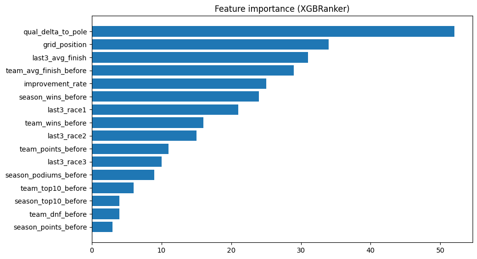

# 🏎 Formula 1 Race Winner Predictor

Predict the **Top-3 most likely winners** of any Formula 1 Grand Prix using a **pairwise ranking XGBoost model** trained on historical race data.

---

## 📌 Project Purpose

The goal of this project is to predict the most likely winners of any upcoming Grand Prix using historical driver and team performance data.
Instead of just predicting a single winner, the model provides a **Top-3 prediction** to better reflect the uncertainty inherent in racing outcomes.

* Model type: **XGBoost Ranker (pairwise ranking)**
* Training data: **2019–2024 F1 seasons**
* Features capture driver performance, recent results, and team stats.

---

## ⚙️ Features

The model relies on the following numeric features for each driver:

| Feature                  | Description                          |
| ------------------------ | ------------------------------------ |
| `grid_position`          | Starting grid position for the race  |
| `season_points_before`   | Driver points before the race        |
| `season_wins_before`     | Total wins in the season so far      |
| `season_podiums_before`  | Total podiums so far                 |
| `season_top10_before`    | Total top-10 finishes                |
| `season_dnf_before`      | Total DNFs (Did Not Finish)          |
| `last3_race1/2/3`        | Finishing positions in last 3 races  |
| `last3_avg_finish`       | Average finish of last 3 races       |
| `improvement_rate`       | Trend compared to previous races     |
| `qual_delta_to_pole`     | Qualifying gap to pole position      |
| `team_points_before`     | Team points before the race          |
| `team_wins_before`       | Team wins so far in the season       |
| `team_podiums_before`    | Team podiums so far                  |
| `team_top10_before`      | Team top-10 finishes so far          |
| `team_dnf_before`        | Team DNFs so far                     |
| `team_avg_finish_before` | Team average finish before this race |


*Figure: Feature importance showing what the model relies on most.*

---

## 🛠 Model Training

* **Algorithm:** `xgboost.XGBRanker` with **pairwise ranking**
* **Hyperparameter tuning:** Grid search with `GroupKFold` CV and **NDCG scoring**
* **Best parameters:**

```python
ranker = xgb.XGBRanker(
    objective='rank:pairwise',
    learning_rate=0.01,
    max_depth=3,
    subsample=0.7,
    colsample_bytree=0.7,
    n_estimators=1000,
    reg_lambda=2,
    reg_alpha=2,
    random_state=42,
    tree_method='hist'
)
```

* **Evaluation:**

  * Top‑1 accuracy (2002): 0.65
  * Top‑3 accuracy (2002): 0.82
  * Top‑1 accuracy (2008): 0.72
  * Train correlation (score vs win): 0.531
  * Test correlation (score vs win): 0.509

---

## 📊 Using the Model

### 1. Prepare your race dataset

Your CSV must contain:

* All numeric features listed above
* Driver and team information
* Race year, round, and name

### 2. Compute `race_id`

```python
df['race_id'] = df['year'].astype(str) + "_" + df['round'].astype(str) + "_" + df['race_name'].str.replace(" ", "_")
```

### 3. Fill missing numeric values

```python
df[numeric_cols] = df[numeric_cols].fillna(df_train[numeric_cols].median())
```

### 4. Load the saved model

```python
import xgboost as xgb

loaded_ranker = xgb.XGBRanker()
loaded_ranker.load_model("xgboost_ranker.json")
```

### 5. Predict and extract Top-3

```python
df['pred_score'] = loaded_ranker.predict(df[feature_cols])

top3 = df.groupby('race_id').apply(
    lambda g: g.sort_values('pred_score', ascending=False).head(3)
).reset_index(drop=True)
```

### 6. Display predictions

prediciton for **2025 UAE GP**!!!!

```
=== Top‑3 predictions for 2025 UAE races ===
Race: 2025_24_United_Arab_Emirates_GP
  Predicted  1: Lando Norris          score = 0.023
  Predicted  2: MAX VERSTAPPEN        score = 0.013
  Predicted  3: Oscar Piastri         score = 0.011
```

---

## 📈 Evaluation

* **Top‑1 accuracy:** Fraction of races where the actual winner is the top prediction
* **Top‑3 accuracy:** Fraction of races where the actual winner is among the predicted top 3
* **Feature importance:** Visualized in `features.png`
* **Generalization:** Model is trained on 2019–2024 seasons and tested on older/unseen seasons (e.g., 2002) to ensure it learns general patterns rather than memorizing data.

---

## 📂 File Structure

```
.
├── README.md
├── xgboost_ranker.json       # Saved trained model
├── formula1-prediction.ipynb # Training and testing code
├── features.png              # Feature importance visualization
```

---

## ⚡ Notes

* The model outputs **scores**, not guaranteed winners. Higher scores → more likely to finish ahead.
* Always check that your input CSV contains all required features for accurate predictions.
* You can visualize **feature importance** to see which attributes the model relies on most.
